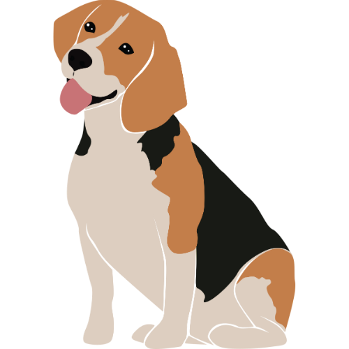

# 🐾 天堂W 寵物屬性評價器

> 一個專為天堂W設計的現代化寵物屬性計算與評價工具，採用One Dark Pro暗黑主題，幫助玩家精準評估寵物成長潛力。


## ✨ 功能特色

- 🖼️ **寵物圖片顯示**：真實寵物圖片替代emoji圖標
- 🎨 **One Dark Pro主題**：現代化暗黑風格介面設計
- 🐺 **四種寵物支援**：狼、杜賓狗、牧羊犬、小獵犬
- 📊 **智能屬性分析**：基於官方機率的精準計算
- ⭐ **主屬性加權**：主屬性1.5倍權重評分系統
- 🎯 **動態評價等級**：五級評價系統配合色彩標示
- 📱 **完全響應式**：支援所有裝置的最佳顯示
- 💡 **即時預期值**：輸入時顯示屬性預期值提示
- 🎮 **角色加成計算**：顯示對角色能力的具體加成
- 🔔 **現代通知系統**：替代傳統alert的美觀提示
- 📖 **分頁式說明**：詳細的使用說明和計算邏輯
- 🌐 **無需安裝**：純前端應用，開啟即用

## 🚀 快速開始

### 本地運行
```bash
# 克隆專案
git clone [repository-url]
cd LineageW-Pet-Evaluator

# 啟動本地伺服器（可選）
python3 -m http.server 8000

# 或直接開啟 index.html
open index.html
```

### 線上使用
直接開啟 `index.html` 檔案即可在瀏覽器中使用。

## 📋 使用指南

### 步驟 1：選擇寵物類型
點擊任一寵物卡片選擇您要分析的寵物：

| 寵物 | 圖示 | 主屬性 | 特色 |
|------|------|--------|------|
| **狼** |  | 體力(HP) | 高血量輸出型 |
| **杜賓狗** |  | 忠誠心(命中) | 高命中輔助型 |
| **牧羊犬** |  | 忍耐力(物防) | 高防禦坦克型 |
| **小獵犬** |  | 速度(迴避) | 高迴避敏捷型 |

### 步驟 2：輸入寵物資訊
- **等級**：輸入寵物當前等級（1-15級）
- **屬性值**：輸入各項屬性的當前數值
- **重要**：請扣除技能、裝備等外部加成

### 步驟 3：查看評價結果
系統將顯示：
- 📊 各屬性詳細成長分析
- ⭐ 主屬性特別標示與加權評分
- 🎮 對角色能力的具體加成效果
- 🏆 整體寵物評價等級與培養建議

#### 📋 分析表格說明
| 欄位 | 說明 |
|------|------|
| **屬性** | 寵物屬性名稱（主屬性標示⭐） |
| **當前值** | 您輸入的實際屬性值 |
| **基礎值** | 該寵物1級時的基礎屬性 |
| **成長值** | 當前值與基礎值的差距 |
| **期望值** | 該等級的理論期望值 |
| **角色加成** | 對角色能力的具體加成效果 |
| **評價** | 基於成長率的屬性評價等級 |

## 📊 評價系統

### 屬性評價標準
| 評價 | 成長率範圍 | 顏色標示 | 說明 |
|------|------------|----------|------|
| **頂級** | ≥ 130% | 🟢 綠色 | 極品屬性，大力培養 |
| **優秀** | 110-129% | 🟢 綠色 | 優質屬性，推薦培養 |
| **良好** | 90-109% | 🔵 藍色 | 標準屬性，可以使用 |
| **普通** | 70-89% | 🟠 橘色 | 一般屬性，考慮替換 |
| **不佳** | < 70% | 🔴 紅色 | 劣質屬性，建議重練 |

### 整體評價等級
| 等級 | 平均分數 | 評語 |
|------|----------|------|
| **神級寵物** | ≥ 90分 | 極品寵物，值得大力培養！ |
| **優質寵物** | 75-89分 | 品質很好，推薦繼續培養 |
| **普通寵物** | 60-74分 | 中規中矩，可作過渡使用 |
| **一般寵物** | 45-59分 | 略低於平均，考慮重新培養 |
| **品質不佳** | < 45分 | 明顯不佳，建議重新培養 |

## 🧮 計算邏輯

### 基礎屬性表
| 寵物 | 忍耐力 | 忠誠心 | 速度 | 積極性 | 體力 |
|------|--------|--------|------|--------|------|
| 狼 | 6 | 6 | 6 | 3 | **14** |
| 杜賓狗 | 6 | **14** | 6 | 3 | 6 |
| 牧羊犬 | **14** | 6 | 6 | 3 | 6 |
| 小獵犬 | 6 | 6 | **14** | 3 | 6 |

### 升級機率分布
**主屬性升級機率：**
- +1: 5% | +2: 15% | +3: 30% | +4: 20% | +5: 15% | +6: 10% | +7: 5%
- **每級期望值：3.75**

**副屬性升級機率：**
- +0: 15% | +1: 50% | +2: 30% | +3: 5%
- **每級期望值：1.25**

**積極性：**
- 固定為3，不會因升級改變

### 角色能力加成
| 寵物屬性 | 角色加成效果 |
|----------|-------------|
| **忍耐力** | 每5點 → +1 物理防禦力 |
| **忠誠心** | 每5點 → +1 近/遠/魔法命中 |
| **速度** | 每10點 → +1 近/遠距離迴避 |
| **體力** | 每1點 → +30 HP |
| **積極性** | 無角色加成效果 |

### 預期值計算（15級範例）
- **主屬性預期值**：基礎值 + (14級 × 3.75) = 基礎值 + 52.5
  - 狼(體力)：14 + 52.5 = **66.5**
  - 其他主屬性：14 + 52.5 = **66.5**
- **副屬性預期值**：6 + (14級 × 1.25) = **23.5**

## 🛠️ 技術架構

### 前端技術棧
- **HTML5**：語義化標籤結構
- **CSS3**：
  - Flexbox & Grid 佈局
  - CSS變數與漸變色彩
  - 響應式媒體查詢
  - 動畫與過渡效果
- **JavaScript ES6+**：
  - 模組化程式設計
  - 事件委託與防抖
  - 動態DOM操作
  - 錯誤處理機制

### 設計特色
- **One Dark Pro配色**：
  - 主背景：#282c34 → #21252b 漸變
  - 主要文字：#abb2bf
  - 標題文字：#e5c07b
  - 強調色彩：#61dafb, #c678dd, #98c379
- **響應式設計**：支援 320px+ 所有裝置
- **現代化UI**：卡片設計、陰影效果、圓角邊框

### 效能優化
- ⚡ 純前端應用，無伺服器依賴
- 🎯 防抖機制減少不必要計算
- 📦 輕量級，總大小 < 1MB
- 🔄 漸進式載入，提升使用者體驗

## 📂 專案結構

```
LineageW-Pet-Evaluator/
├── index.html              # 主頁面
├── styles.css              # 樣式表（One Dark Pro主題）
├── script.js               # 主要邏輯
├── README.md               # 專案說明
├── OrionKao.png           # 網站圖標
├── wolf.png               # 狼圖片
├── dubin.png              # 杜賓狗圖片
├── sheepdog.png           # 牧羊犬圖片
└── beagle.png             # 小獵犬圖片
```

## 🎯 使用注意事項

### ⚠️ 重要提醒
1. **扣除技能加成**：輸入純寵物屬性值，不含技能/裝備加成
2. **等級限制**：目前支援 1-15 級寵物評價
3. **積極性固定**：積極性恆為3，不參與成長計算
4. **參考性質**：計算結果僅供參考，實際遊戲可能有其他因素

### 🔍 疑難排解
- **圖片不顯示**：確保寵物圖片檔案在正確位置
- **計算異常**：檢查輸入值是否在合理範圍內
- **樣式異常**：確認瀏覽器支援CSS3特性
- **響應問題**：嘗試重新整理頁面

## 📝 更新日誌

### V2.1
- **比較欄位增加期望值**
- **增加GOOGLE Analytics 4 流量分析**


### v2.0.0 (最新版本)
- 🎨 **全新One Dark Pro主題**：現代化暗黑風格設計
- 🖼️ **寵物圖片系統**：真實寵物圖片替代emoji
- 🔧 **等級範圍調整**：由1-100改為1-15級
- 🧮 **計算邏輯優化**：修正預期值計算錯誤
- 🛡️ **錯誤處理改善**：防止除零錯誤和異常輸入
- 📱 **響應式優化**：更好的移動端體驗
- 🔔 **通知系統**：現代化提示訊息
- 📖 **說明系統**：分頁式詳細說明
- 🌐 **Favicon支援**：瀏覽器標籤圖示
- 📊 **期望值顯示**：在分析表格中新增期望值欄位

### v1.1.0
- 修正屬性名稱錯誤
- 新增角色能力加成顯示
- 積極性設為固定值3
- 更新評價系統

### v1.0.0
- 初始版本發布
- 四種寵物類型支援
- 基礎計算與評價系統

## 📄 授權條款

本專案採用 MIT 授權條款 - 詳見 [LICENSE](LICENSE) 檔案

## 👨‍💻 作者資訊

**Created by OrionKao**

- 📧 Email: [聯絡信箱]
- 🌐 GitHub: [GitHub連結]
- 🎮 專為天堂W玩家設計

---

### 🙏 致謝

感謝天堂W官方提供的寵物升級機率數據，以及所有測試使用者的寶貴建議。

**如果這個工具對您有幫助，歡迎給個 ⭐ Star！** 